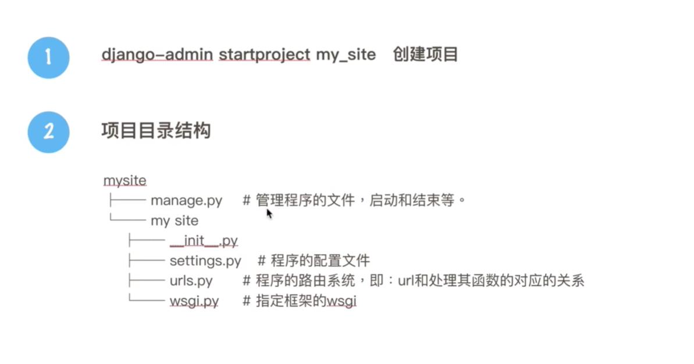
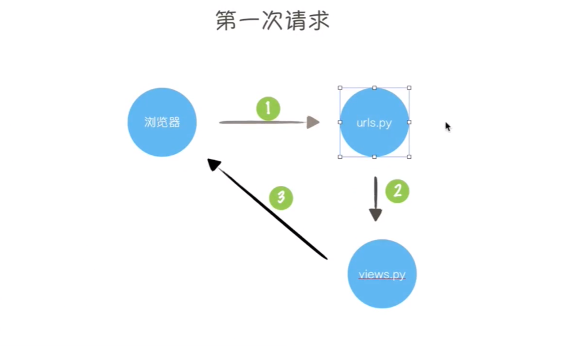
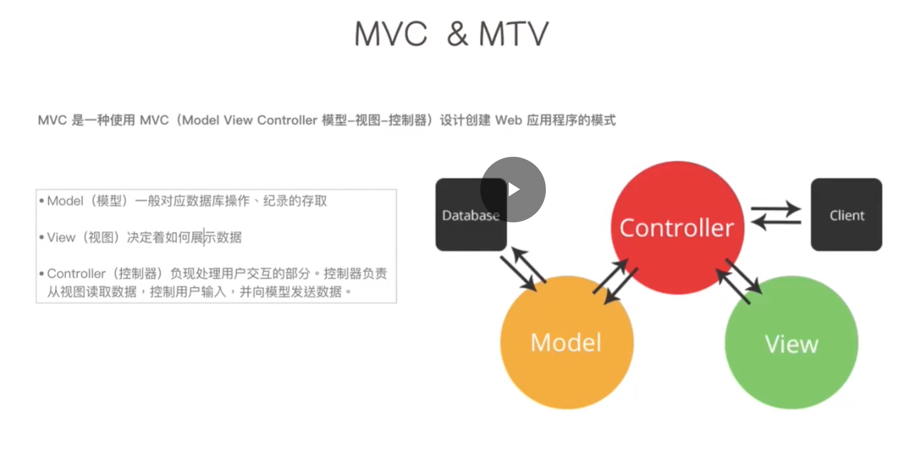
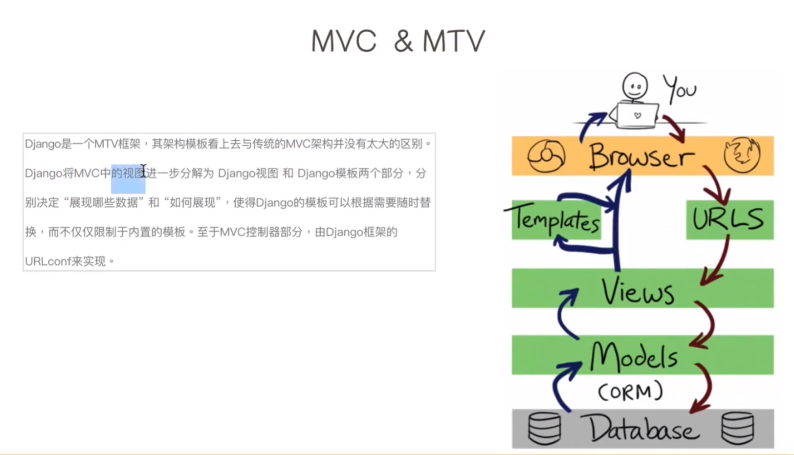
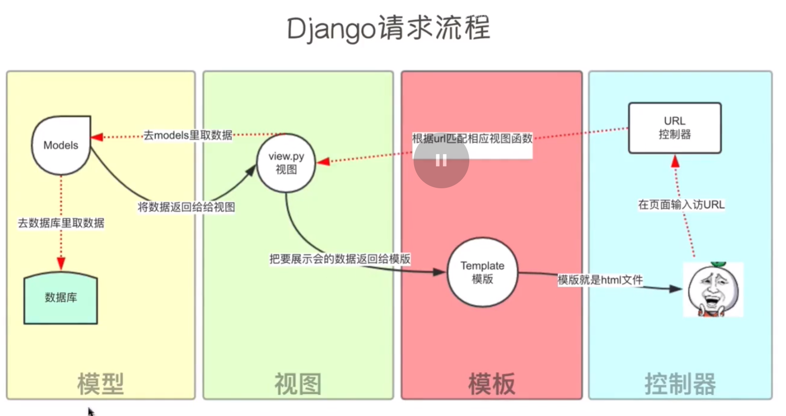
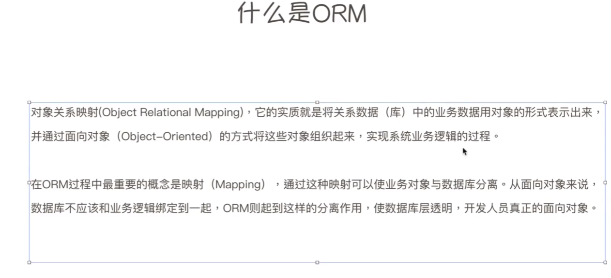
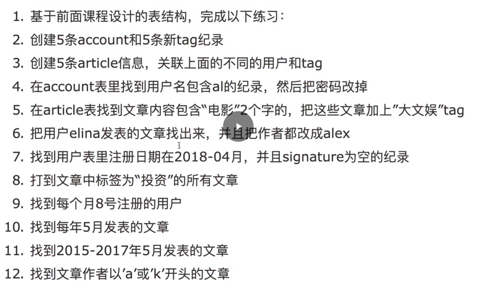

## 概述
* Django是python下的一个最强大的web框架
* Django是全球第五大web框架
* Instgram是已Django作为后端服务器语言开发

## http协议
* 基于TCP/IP协议
* 短链接
* 被动响应
* 无状态

## web框架的本质
1. 浏览器是socket客户端，网站是socket服务端
2. wsgi是一个规范，wsgiref实现了这个规范并在其内部实现了socket服务端
3. 根据url的不同执行不同的函数，即：路由系统
4. 使用函数式编程处理业务逻辑
5. 图片、css、js文件统一称为静态文件，需要读取内容直接返回给客户端

### 使用django创建一个web项目
* `django-admin startproject mysite`
* 

### 使用django创建一个app
* `python manage.py startapp app01` 
* 一个项目中可以有多个app，每个app的功能都不同，例如支付宝里面的支付模块-小程序模块等、微信里面的聊天模块-支付模块、淘宝中的支付模块-视频模块等业务代码
```python
  polls/
    __init__.py # 包
    admin.py # 数据库后台
    apps.py # 把项目和app关联起来的文件
    migrations/ # 数据库相关
        __init__.py
    models.py # 数据库操作地方
    tests.py # 单元测试
    views.py # 业务逻辑函数
​```
```

## 第一次请求
1. 匹配路由，路由分发器查找用户的url对应关系
   1. 找到业务函数，调用
   2. 找不到，报404
2. 返回数据给浏览器

### django中的第一次请求
* 

### 启动web服务器
1. 编写路由
2. 在view.py中写业务函数
3. 通过HttpResponse方法返回数据给前端，HttpResponse是django中把响应头等内容封装的函数
4. 在mysite目录下执行命令`python manage.py runserver`，启动服务
   
## 模板配置
1. 配置setting.py，django找到模板的html的template文件
2. 调用render函数

## MVC/MTV
* MVC
  * VIEWS: 业务逻辑处理和数据展示
  * 
* MTV
  * VIEWS: 业务逻辑处理
  * TEMPLATE: 数据展示
  * 
* django中的数据请求流程
  * 

## 路由系统详解
### 两种路由形式
#### 静态路由
  * 逐个匹配所有字符`path("articles/2003/", views.special_case_2003)` 
#### 动态路由
  ##### URLconf
    ```python
        urlpatterns = [
            path("articles/2003/", views.special_case_2003),
            path("articles/<int:year>/", views.year_archive),
            path("articles/<int:year>/<int:month>/", views.month_archive),
            path("articles/<int:year>/<int:month>/<slug:slug>/", views.article_detail),
        ]
    ```
  ##### regular expressions
    ```python
      urlpatterns = [
        path("articles/2003/", views.special_case_2003),
        re_path(r"^articles/(?P<year>[0-9]{4})/$", views.year_archive),
        re_path(r"^articles/(?P<year>[0-9]{4})/(?P<month>[0-9]{2})/$", views.month_archive),
        re_path(r"^articles/(?P<year>[0-9]{4})/(?P<month>[0-9]{2})/(?P<slug>[\w-]+)/$", views.article_detail)
      ]
    ```

### 路由的分发
* mysites2下的urls使用include分发到app02中
* 分发到app02后在客户端使用`http://127.0.0.1:8000/app02/articles/2005/`访问，实现路由的分发

## 在view中操作数据库
### 自己写sql的问题
1. sql注入
2. 如果使用mySql数据库写了10万行代码，中途如果需要换Oracle数据库，那么因为有些sql语句的不同，修改10万行代码几乎不可能
3. 开发人员原生sql水平不一，导致性能问题
4. 开发效率低

### ORM对象关系映射


#### 优点
1. 实现代码与数据库的解耦，即使中途更换数据库，无需修改面向对象的代码
2. 不需要自己写原生sql，提高开发效率
3. 防止SQL注入

#### 缺点
1. 牺牲性能
2. 语句太复杂

#### Django ORM字段
##### 字段类型1
``` python
    AutoField # An IntergerField that autonatically increamts according to available
    BigAutoField # A 64-bits integer, guaranteed to fit numbers from 1 t0 9223372036854775807
    BigIntegerField # -92233720368547808 to 9223372036854775807
    BooleanField # True or False
    CharField # A string field
    DateField # e.g . 2017-01-01
    DateTimeField # e.g. 2017-01-01 12:00:00
    DecimalField # A fixed-point number, 整数部分最多10位，小数点后最多2位
    DurationField # A field for storing a duration, storing periods of time, e.g [DD] [HH:[MM:]ss[.uuuuuu]]
    EmailField # A CharField that checks that the value is a valid email address
    FileField # A FileField that validates that the uploaded file is a valid
    FloatField # A floating point number
    ImageField # A FileField that validates that the uploaded file is a valid image
    IntegerField # A signed 32 bits integer
    GenericIPAddressField # An IP address that can be either an IPv4 or IPv6 address
    NullBooleanField # True, False or None
    PositiveIntegerField # A signed 32 bits integer that cannot be less than 0
    PositiveSmallIntegerField # A signed 18 bits integer that cannot be less than 0
    SlugField # A CharField that validates that the value contains only letters, numbers, underscores or hyphens
    SmallIntegerField # A signed 18 bits integer
    TextField # A CharField that validates that the length of the value is less than 255
    TimeField # A field that accepts time values (in Python datetime.time format)
    URLField # A CharField that accepts URL values
    UUIDField # A CharField that accepts UUID values
```

##### 字段类型2
``` python
    Relationship field # A field that defines a relational mapping
    ForeigKey # A field on an _other_ model that refers to another model
    ManyToManyField # A field that defines a relational mapping with another _mapping_ model
    
    OneToOneField # A field that defines a relational mapping with another _mapping_ model
```

### 连接mySql
* 安装`python -m pip install pymysql`，替换掉python自带的mysqlDB模块
* 在mysite2文件下的__init__.py中，导入pymysql模块
* 修改settings.py中的DATABASES

#### django数据库同步工具
* `migration`，生成同步文件，`python manage.py makemigrations`
* 同步文件，`python manage.py migrate`，同步后在app02的mogrations这个文件夹下面
* 在setting中，INSTALLED_APPS中加入创建的app名称

#### 报错解决
1. mysql远程连接设置问题
   * `django.db.utils.OperationalError: (1044, "Access denied for user ''@'localhost' to database 'blog'")`原因是mysql没  有设置远程连接
   *  `GRANT ALL PRIVILEGES ON *.* TO 'root'@'%' IDENTIFIED BY '123456' WITH GRANT OPTION;`设置远程连接
2. django版本和mysql版本不匹配问题
   * 重新安装django版本2.1

### 增删改查
#### 先使用命令行操作数据库
* `python manage.py shell`，必须使用这行命令，直接使用python无法加载当前django下的环境变量，会报错
* `from app02 import models`，导入app02下的models，不导入无法使用该变量
#### 增
1. 使用命令行增加一条数据：
``` python
models.Account.objects.create(
    username = 'jack',
    email = 'jack@qq.com',
    password = '123456'
    ,
    )
```
2. 先准备好数据，再手动触发提交
``` python
s = models.Account(        
    username = 'zhangsan',      
    email = 'zhangsan@163.com', 
    password = 'abc',           
    signature = 'zhangsan love Judy'
  )
s.save() # 把数据加入到数据库中
```
3. 跨表创建数据
  * 使用外键创建
  ``` python
  s = models.Article(
    title = '张艺谋表示很震惊',
    content = '在片场，今天张艺谋被张国立的演技震惊了',
    pub_date = '2023-10-20'
  )
  s.account_id = 1
  s.save()
  ```
  * 使用多对多对象创建
  ```python
  a1 = models.Account(
    username = 'lisi',
    password = '123456',
    email = 'lisi@qq.com'
  )
  a1.save()
  s = models.Article(
    title = 'test',
    content = 'hahaha',
    pub_date = '2023-10-20'
  )
  # 把a1直接赋给文章中的作者
  s.account = a1
  s.save()
  ```

###### 通过orm语句实现多对多关联
1. create a object
2. 通过创建成功的对象添加多对多关联

#### 查询
1. 查询id等于1的所有数据 `select * from app02_account where id = 1` 等价于orm中的 `modles.Account.objects.filter(id=1)`
2. 查询id大于1的所有数据 `select * from app02_account where id > 1 and passwors = '123456'` 等价于orm中的 `models.Account.objects.filter(id__gt = 1, password = '123456')`, gt表示大于, gte表示大于等于, lt表示小于, lte表示小于等于, 还可以使用`between and`
3. 把邮箱中的z字母开头的邮箱查找出来`select * from app02_account where like "z%"` 等价于orm中的 `models.Account.objects.filter(email__startswith='z')`， startswith表示以什么开头，endswith表示以什么结尾，contains表示包含

##### 查询的orm过滤条件语句
1. filter
   * 查询username包含'a'的所有数据`select * from app02_account where username like "%a%"` 等价于 `models.Account.objects.filter(username__contains='a')`，mysql原生写法不区分大小写，而orm语句默认区分大小写，
`models.Account.objects.filter(username__icontains='a')` 这里加i表示大小写不敏感
2. in
   * 查询id在(1, 2, 3)中所有的数据`select * from app02_account where id in (1, 2, 3)` 等价于 `models.Account.objects.filter(id__in = (1, 2, 3))`
3. range查询时间、数据、日期
   * 在setting中修改时间为东八区的上海时间
   * 查询`t1 = datetime.date(2023, 10, 19) t2 = datetime.date(2023, 10, 25)` 这个时间段的数据(不包含2023-10-25) ` models.Account.objects.filter(register_date__range=[t1, t2])`， select原生语句`select ... where register_date between '2023-10-9' and '2023-10-25';`
   * 查询id在2-10之间的数据 `models.Account.objects.filter(id__range=[2, 10])`
4. date
   * 查询注册日期为2023-10-20的数据 `models.Account.objects.filter(register_date__date='2023-10-20')`
5. year
  * 查询2023年的数据 `models.Account.objects.filter(register_date__year=2023)`
6. month
   * 查询每年10月的数据 `models.Account.objects.filter(register_date__month=10)`
7. week_day
   * 查询每周一的数据 `models.Account.objects.filter(register_date__week_day=1)`
8. week
   * 查询2023年10月20日所在周的数据 `models.Account.objects.filter(register_date__week='2023-10-20')`
9.  day
   * 查询每月20日的数据 `models.Account.objects.filter(register_date__day=20)`
10. hour 
   * 查询每天12点数据 `models.Account.objects.filter(register_date__hour=12)`
11. minute
   * 查询每小时12分数据 `models.Account.objects.filter(register_date__minute=12)`
12. second
   * 查询每分钟第12秒的数据 `models.Account.objects.filter(register_date__second=12)`
13. regex
   * 查询用户名中已z和l开头的数据 `models.Account.objects.filter(username__regex=r'^(z|l)')` r表示转义，大小写敏感，iregex表示大小写敏感  ``models.Account.objects.filter(username__iregex=r'^(Z|L)')`
14. isnull
   * 查询用户名为空的 `models.Account.objects.filter(username__isnull=True)`
15. order_by
   * 查询用户名倒序 `models.Account.objects.order_by('-username')`
   * 按日期升序 `a.values('id', 'register_date').order_by('register_date')`
16. reverse反转，如果想用reverse，必须先使用order_by排序好
   * `a.values('id', 'register_date').order_by('register_date').reverse`

#### 获取对象中的数据
* a = `a = models.Account.objects.all()`, 查询所有数据中的password `a.values('password')`

#### 精确查找
* `models.Account.objects.get(username='zhangsan')` 精确查询一条已经存在且不重复的数据
* `models.Account.objects.all()` 返回所有的数据
* exclued: 排除符合条件的数据，不符合条件的返回

#### 删改
* 删除一条数据 `models.Account.objects.get(username='zhangsan').delete()` 删除所有符合条件数据
* 单条修改 `models.Account.objects.filter(username='zhangsan').update(password='123456')` 更新

#### 聚合搜索
* 查询总条数 `models.Account.objects.all().count()`
* 查询最大值 `models.Account.objects.all().aggregate(Max('age'))`
* 查询最小值 `models.Account.objects.all().aggregate(Min('age'))`
* 查询平均值 `models.Account.objects.all().aggregate(Avg('age'))`
* 查询总和 `models.Account.objects.all().aggregate(Sum('age'))`
* 查询最大值和最小值 `models.Account.objects.all().aggregate(Max('age'), Min('age'))`

#### 练习
